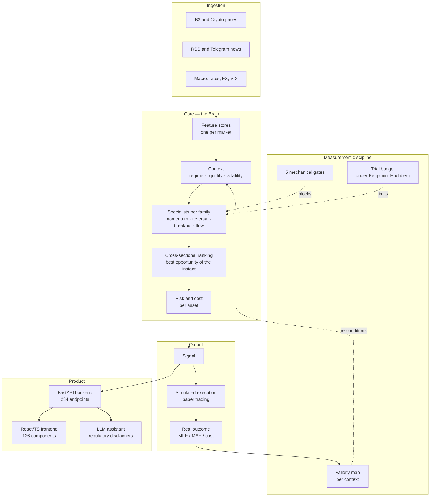

# Radar Preditivo — case study

**A financial intelligence platform built solo, running in production, that refuses to
believe its own results.**

🇧🇷 [Português](README.md) · 🇪🇸 [Español](README.es.md) · 🇺🇸 **English**

> This repository **does not contain the product's code**. It is the case study: what
> the system does, how it is built, and which hard problems showed up. Two slices of the
> code are public and linked at the end — the rest is closed.

Live product: **[apexfinance.group](https://apexfinance.group)**

---

## What it is

A system that reads the market — news, prices, macro indicators, crypto microstructure —
and looks for **trading opportunities** across four investor profiles (scalping, day
trade, swing, position). It interprets with an LLM, contextualizes with history,
validates with statistics, blocks with risk, measures with simulation, and recalibrates.
The final decision is always the human's.

```
1,646 commits · 1,991 files · built by one person
~75,000 lines of Python  ·  ~36,000 lines of TypeScript/React
330 test files  ·  234 endpoints  ·  126 components  ·  42 ADRs
in production: own VPS, nginx, systemd, cron, automated deploy, blocking CI
```

## Architecture



**Stack:** Python 3.11 · FastAPI · SQLAlchemy + Alembic · Pydantic · pandas/numpy/scipy ·
Anthropic SDK · React + TypeScript + Vite · SQLite (PostgreSQL as the path) · nginx ·
systemd · GitHub Actions.

---

## The hard problems

This is the part that matters. None of them is about frameworks.

### 1. The model went silent for a month and was read as "selective"

The signal engine stopped emitting in production. Nobody noticed for four weeks, because
**a system that emits nothing looks prudent**. The investigation found four chained
defects: nine models trained with a single tree, a calibrator whose probability ceiling
sat *below* the emission threshold, seven of 45 input columns constant within the day —
the model learned the *day*, not the *asset* — and a crypto store carrying calendar
columns from the Brazilian exchange.

No test caught any of it, because no test treated silence as a defect.

The answer was a **contract of five mechanical gates**, verified by `pytest` rather than
by human review. The most important one: **muteness is FAILURE, never abstention**. And
another: the threshold must be reachable on the scale it is expressed in — exactly what
was missing when a 0.60 cutoff was compared against a calibrator whose ceiling was 0.187.

The verdict on everything that had passed through that engine became **INCONCLUSIVE**,
neither "it works" nor "it doesn't". Redoing the reading was cheaper than trusting it.

### 2. Searching for patterns in prices always finds patterns

With enough data and enough freedom, any backtest looks good. The usual defense —
counting trials and stopping at a cap — is wrong: the admissible space under
Benjamini-Hochberg depends on the **distribution** of p-values, not on the count.

So the trial budget is **derived**, recomputed from the full grid every round. A null
hypothesis consumes statistical space; a strong one gives space back. There is no
`remaining -= 1` in the code.

Alongside it: pre-registered partitioning in a separate commit, economic mechanism
declared *before* measuring, walk-forward validation with no look-ahead, and
cross-replication. Conditioning without those brakes finds false alpha with probability
close to 1.

### 3. Silent failure is worse than loud failure

The LLM cost breaker reads an append-only ledger to decide whether it may still spend.
If the read fails, it **blocks** instead of allowing — and a corrupted ledger line also
blocks, because `json.loads` propagates the exception rather than under-counting spend.
Failing open would have been the comfortable choice and the wrong one.

Same doctrine in the governance gate: an audit run reported `0 findings` with exit code
0, because the package had shipped without the rules and a `glob` over a nonexistent
directory raises no error. Today a canary **fails a zero score** — silence stopped
counting as approval.

### 4. Real orders are a gate, not a dogma

The system **does not place real orders**, and that is a deliberate lock with written
release criteria: position reconciliation, validated cost/slippage model, automatic
close-out, real broker integration. While any of them is open, the environment variable
that would enable execution causes an intentional boot failure.

The execution layer exists and is tested — paper broker, risk-based sizing, exchange
cost model, risk manager. What does not exist is the authorization.

### 5. Governance that audits its own author

Working alone, there is no reviewer. So the reviewer became code: a separate system of
**283 deterministic rules** that audits the entire repository — security, infrastructure,
quality, debt, data — and is a blocking step in CI. The LLM only steps in when the
deterministic rule cannot decide.

It is public: **[batman-os](https://github.com/vieiragomesrodrigo98-sketch/batman-os)**.

---

## Public code

Two real, runnable slices with green CI:

| Repository | What it is |
|---|---|
| **[cerebro-quant](https://github.com/vieiragomesrodrigo98-sketch/cerebro-quant)** | The decision core: the 5 gates, the derived budget, the cross-sectional ranking. 597 tests, runs with no database and no network. |
| **[batman-os](https://github.com/vieiragomesrodrigo98-sketch/batman-os)** | The governance layer: 283 deterministic rules, 1,500+ tests, `mypy --strict` clean. |

The rest — ingestion, feature stores, API, frontend, LLM integration, execution layer and
the research history — is closed.

## What this project taught me

That the hard part of a quantitative system is not finding the signal. It is building the
thing that stops you from fooling yourself, and then **accepting the verdict** when it
says you found nothing. Three of my own theses died measured. The system that killed them
is the most valuable thing I own.

---

<sub>Rodrigo Gomes Vieira · [apexfinance.group](https://apexfinance.group)</sub>
