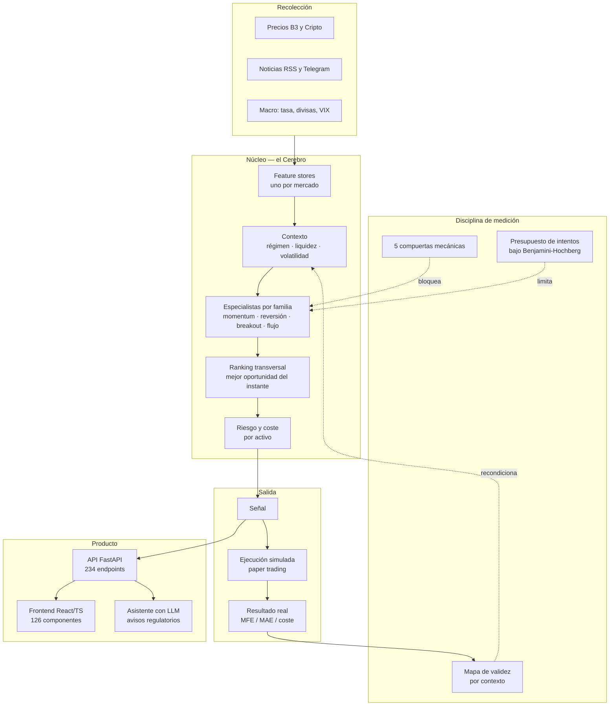

# Radar Preditivo — estudio de caso

**Una plataforma de inteligencia financiera construida en solitario, en producción, que
se niega a creerse sus propios resultados.**

🇧🇷 [Português](README.md) · 🇪🇸 **Español** · 🇺🇸 [English](README.en.md)

> Este repositorio **no contiene el código del producto**. Es el estudio de caso: qué
> hace el sistema, cómo está construido y qué problemas difíciles aparecieron. Dos
> porciones del código son públicas y están enlazadas al final — el resto es cerrado.

Producto en vivo: **[apexfinance.group](https://apexfinance.group)**

---

## Qué es

Un sistema que lee el mercado — noticias, precios, indicadores macro, microestructura de
cripto — y busca **oportunidades de operación** para cuatro perfiles de inversor
(scalping, day trade, swing, position). Interpreta con LLM, contextualiza con histórico,
valida con estadística, bloquea con riesgo, mide con simulación y recalibra. La decisión
final siempre es del humano.

```
1.646 commits · 1.991 archivos · construido por una persona
~75.000 líneas de Python  ·  ~36.000 líneas de TypeScript/React
330 archivos de prueba  ·  234 endpoints  ·  126 componentes  ·  42 ADRs
en producción: VPS propia, nginx, systemd, cron, despliegue automatizado, CI bloqueante
```

## Arquitectura



**Stack:** Python 3.11 · FastAPI · SQLAlchemy + Alembic · Pydantic · pandas/numpy/scipy ·
Anthropic SDK · React + TypeScript + Vite · SQLite (PostgreSQL como camino) · nginx ·
systemd · GitHub Actions.

---

## Los problemas difíciles

Esta es la parte que importa. Ninguno de ellos trata sobre frameworks.

### 1. El modelo quedó mudo un mes entero y se leyó como "selectivo"

El motor de señales dejó de emitir en producción. Nadie lo notó durante cuatro semanas,
porque **un sistema que no emite parece prudente**. La investigación encontró cuatro
defectos encadenados: nueve modelos entrenados con un solo árbol, un calibrador cuyo
techo de probabilidad quedaba *por debajo* del umbral de emisión, siete de 45 columnas
de entrada constantes dentro del día — el modelo aprendió el *día*, no el *activo* — y
un store de cripto cargando columnas de calendario de la bolsa brasileña.

Ninguna prueba detectó nada de eso, porque ninguna trataba el silencio como defecto.

La respuesta fue un **contrato de cinco compuertas mecánicas**, verificadas por `pytest`
y no por revisión humana. La más importante: **la mudez es FALLO, nunca abstención**. Y
otra: el umbral debe ser alcanzable en la escala en que se expresa — exactamente lo que
faltaba cuando un corte de 0,60 se comparaba con un calibrador cuyo techo era 0,187.

El veredicto de todo lo que había pasado por ese motor pasó a ser **NO CONCLUYENTE**, ni
"funciona" ni "no funciona". Rehacer la lectura salió más barato que confiar en ella.

### 2. Buscar patrones en precios siempre encuentra patrones

Con suficientes datos y suficiente libertad, cualquier backtest queda bonito. La defensa
habitual — contar intentos y parar en un techo — es incorrecta: el espacio admisible
bajo Benjamini-Hochberg depende de la **distribución** de los p-valores, no del conteo.

Por eso el presupuesto de intentos es **derivado**, recalculado a partir de la rejilla
completa en cada ronda. Una hipótesis nula consume espacio estadístico; una fuerte lo
devuelve. No existe `remaining -= 1` en el código.

Junto a eso: particionamiento pre-registrado en commit separado, mecanismo económico
declarado *antes* de medir, validación walk-forward sin look-ahead, y replicación
cruzada. Condicionar sin esas trabas encuentra alfa falso con probabilidad cercana a 1.

### 3. El fallo silencioso es peor que el ruidoso

El breaker de coste de LLM lee un ledger append-only para decidir si aún puede gastar.
Si la lectura falla, **bloquea** en vez de liberar — y una línea corrupta en el ledger
también bloquea, porque `json.loads` propaga la excepción en lugar de subcontar el
gasto. Fallar abierto habría sido la opción cómoda y la equivocada.

Misma doctrina en la compuerta de gobernanza: una auditoría reportó `0 hallazgos` con
código de salida 0, porque el paquete se había publicado sin las reglas y un `glob`
sobre un directorio inexistente no lanza error. Hoy existe un canario que **reprueba el
marcador cero** — el silencio dejó de ser aprobación.

### 4. La orden real es una compuerta, no un dogma

El sistema **no ejecuta órdenes reales**, y es una traba deliberada con criterios de
liberación escritos: reconciliación de posiciones, modelo de coste/slippage validado,
cierre automático, bróker real integrado. Mientras alguno siga abierto, la variable de
entorno que liberaría la ejecución provoca un fallo intencional en el arranque.

La capa de ejecución existe y está probada — bróker de papel, sizing por riesgo, modelo
de costes de la bolsa, gestor de riesgo. Lo que no existe es la autorización.

### 5. Gobernanza que audita al propio autor

Trabajando solo no hay revisor. Así que el revisor se volvió código: un sistema aparte
de **283 reglas deterministas** que audita el repositorio entero — seguridad,
infraestructura, calidad, deuda, datos — y es paso bloqueante en CI. El LLM solo entra
cuando la regla determinista no decide.

Es público: **[batman-os](https://github.com/vieiragomesrodrigo98-sketch/batman-os)**.

---

## Código público

Dos porciones reales, ejecutables, con CI en verde:

| Repositorio | Qué es |
|---|---|
| **[cerebro-quant](https://github.com/vieiragomesrodrigo98-sketch/cerebro-quant)** | El núcleo de decisión: las 5 compuertas, el presupuesto derivado, el ranking transversal. 597 pruebas, corre sin base de datos ni red. |
| **[batman-os](https://github.com/vieiragomesrodrigo98-sketch/batman-os)** | La gobernanza: 283 reglas deterministas, 1.500+ pruebas, `mypy --strict` limpio. |

El resto — ingesta, feature stores, API, frontend, integración de LLM, capa de ejecución
y el historial de investigación — es cerrado.

## Lo que este proyecto me enseñó

Que la parte difícil de un sistema cuantitativo no es encontrar la señal. Es construir
aquello que te impide engañarte, y luego **aceptar el veredicto** cuando dice que no
encontraste nada. Tres tesis mías murieron medidas. El sistema que las mató es lo más
valioso que tengo.

---

<sub>Rodrigo Gomes Vieira · [apexfinance.group](https://apexfinance.group)</sub>
