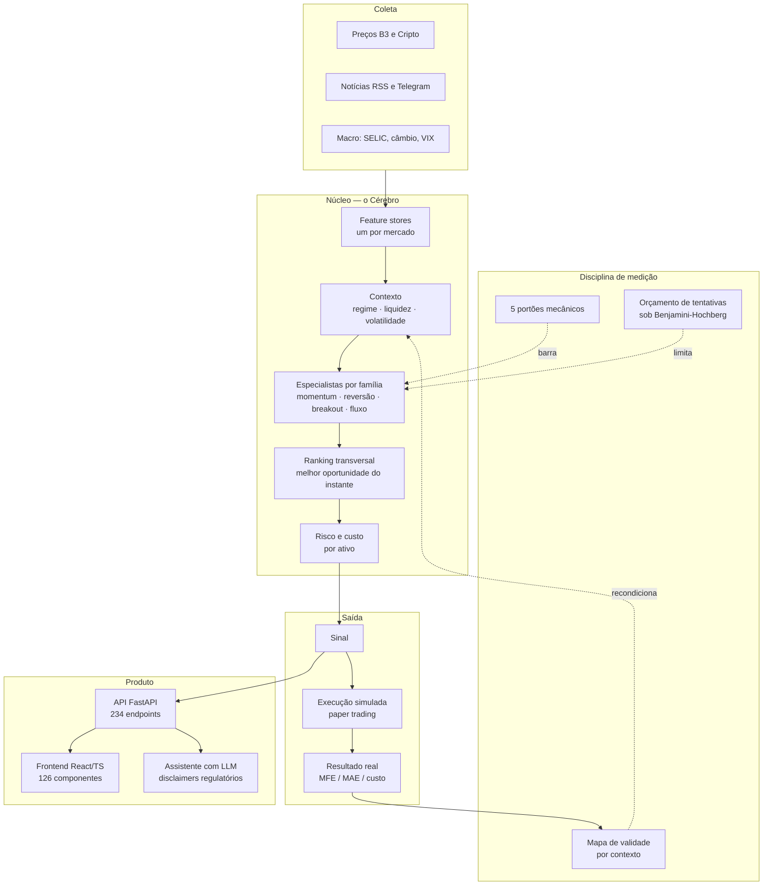

# Radar Preditivo — estudo de caso

**Uma plataforma de inteligência financeira construída sozinho, em produção, que se
recusa a acreditar nos próprios resultados.**

🇧🇷 **Português** · 🇪🇸 [Español](README.es.md) · 🇺🇸 [English](README.en.md)

> Este repositório **não contém o código do produto**. É o estudo de caso: o que o
> sistema faz, como está construído e quais problemas difíceis apareceram no caminho.
> Duas fatias do código são públicas e estão linkadas no fim — o resto é fechado.

Produto no ar: **[apexfinance.group](https://apexfinance.group)**

---

## O que é

Um sistema que lê o mercado — notícias, preços, indicadores macro, microestrutura de
cripto — e procura **oportunidades de operação** para quatro perfis de investidor
(scalping, day trade, swing, position). Ele interpreta com LLM, contextualiza com
histórico, valida com estatística, bloqueia com risco, mede com simulação e recalibra.
A decisão final é sempre do humano.

```
1.646 commits · 1.991 arquivos · construído por uma pessoa
~75.000 linhas de Python  ·  ~36.000 linhas de TypeScript/React
330 arquivos de teste  ·  234 endpoints  ·  126 componentes  ·  42 ADRs
em produção: VPS própria, nginx, systemd, cron, deploy automatizado, CI bloqueante
```

## Arquitetura



**Stack:** Python 3.11 · FastAPI · SQLAlchemy + Alembic · Pydantic · pandas/numpy/scipy ·
Anthropic SDK · React + TypeScript + Vite · SQLite (PostgreSQL como caminho) · nginx ·
systemd · GitHub Actions.

---

## Os problemas difíceis

Esta é a parte que interessa. Nenhum deles é sobre framework.

### 1. O modelo ficou mudo um mês inteiro e foi lido como "seletivo"

O motor de sinais parou de emitir em produção. Ninguém notou por quatro semanas, porque
**um sistema que não emite parece prudente**. A investigação achou quatro defeitos
encadeados: nove modelos treinados com uma única árvore, um calibrador cujo teto de
probabilidade ficava *abaixo* do limiar de emissão, sete de 45 colunas de entrada
constantes dentro do dia — o modelo aprendeu o *dia*, não o *ativo* — e um store de
cripto carregando colunas de calendário da bolsa brasileira.

Nenhum teste pegou nada disso, porque nenhum teste tratava silêncio como defeito.

A resposta foi um **contrato de cinco portões mecânicos**, verificados por `pytest` e
não por revisão humana. O mais importante deles: **mudez é FALHA, nunca abstenção**. E
outro: o limiar precisa ser alcançável na escala em que se expressa — foi exatamente o
que faltava quando o gate de 0,60 era comparado a um calibrador cujo teto era 0,187.

O veredito de tudo que tinha passado por aquele motor virou **INCONCLUSIVO**, não
"funciona" nem "não funciona". Refazer a leitura foi mais barato que confiar nela.

### 2. Procurar padrão em preço sempre acha padrão

Com dados suficientes e liberdade suficiente, qualquer backtest fica bonito. A defesa
usual — contar tentativas e parar num teto — está errada: o espaço admissível sob
Benjamini-Hochberg depende da **distribuição** dos p-valores, não da contagem.

Então o orçamento de tentativas é **derivado**, recalculado a partir da grade inteira a
cada rodada. Uma hipótese nula consome espaço estatístico; uma hipótese forte devolve
espaço. Não existe `remaining -= 1` no código.

Junto disso: particionamento pré-registrado em commit separado, mecanismo econômico
declarado *antes* da medição, validação walk-forward sem look-ahead, e replicação
cruzada. Condicionar sem essas travas acha alpha falso com probabilidade próxima de 1.

### 3. Falha silenciosa é pior que falha barulhenta

O breaker de custo de LLM lê um ledger append-only para decidir se ainda pode gastar. Se
a leitura falhar, ele **bloqueia** em vez de liberar — e uma linha corrompida no ledger
também bloqueia, porque `json.loads` propaga a exceção em vez de subcontar o gasto.
Falhar aberto teria sido a escolha confortável e a errada.

Mesma doutrina no portão de governança: uma execução de auditoria reportou `0 achados`
com código de saída 0, porque o pacote tinha sido publicado sem as regras e um `glob`
em diretório inexistente não levanta erro. Hoje existe um canário que **reprova placar
zero** — silêncio deixou de ser aprovação.

### 4. Ordem real é portão, não dogma

O sistema **não executa ordens reais**, e isso é uma trava deliberada com critérios de
liberação escritos: reconciliação de posição, modelo de custo/slippage validado,
fechamento automático, corretora real integrada. Enquanto qualquer um estiver aberto, a
variável de ambiente que liberaria a execução causa falha intencional no boot.

A camada de execução existe e é testada — broker de papel, sizing por risco, modelo de
custos da B3, gestor de risco. O que não existe é a autorização.

### 5. Governança que audita o próprio autor

Trabalhando sozinho, não há revisor. Então o revisor virou código: um sistema separado
de **283 regras determinísticas** que audita o repositório inteiro — segurança,
infraestrutura, qualidade, dívida, dados — e é passo bloqueante no CI. O LLM só entra
quando a regra determinística não decide.

Ele é público: **[batman-os](https://github.com/vieiragomesrodrigo98-sketch/batman-os)**.

---

## Código público

Duas fatias reais, executáveis, com CI verde:

| Repositório | O que é |
|---|---|
| **[cerebro-quant](https://github.com/vieiragomesrodrigo98-sketch/cerebro-quant)** | O núcleo de decisão: os 5 portões, o orçamento derivado, o ranking transversal. 597 testes, roda sem banco nem rede. |
| **[batman-os](https://github.com/vieiragomesrodrigo98-sketch/batman-os)** | A governança: 283 regras determinísticas, 1.500+ testes, `mypy --strict` limpo. |

O restante — ingestão, feature stores, API, frontend, integração de LLM, camada de
execução e o histórico de pesquisa — é fechado.

## O que este projeto me ensinou

Que a parte difícil de um sistema quantitativo não é achar o sinal. É construir o que
te impede de se enganar, e depois **aceitar o veredito** quando ele diz que você não
achou nada. Três teses minhas morreram medidas. O sistema que as matou é o que eu tenho
de mais valioso.

---

<sub>Rodrigo Gomes Vieira · [apexfinance.group](https://apexfinance.group)</sub>
